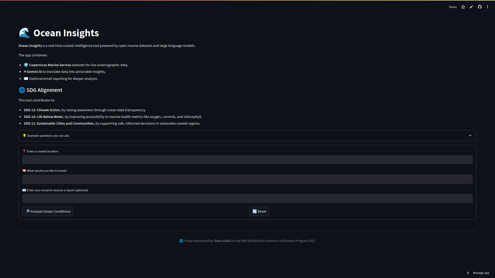

# 🌊 Ocean Insights


**Real-time coastal intelligence powered by Copernicus Marine datasets and Gemini AI, with optional email reporting**


## 🧠 What is Ocean Insights?


**Ocean Insights** is a user-friendly web app that combines **Copernicus Marine Service** oceanographic datasets and **Gemini AI** to answer natural language queries about ocean conditions. It also offers optional **email reports** containing detailed data summaries.


## 🚀 Features


- 📍 Search **any coastal location** globally
- 📦 Fetches **real-time marine datasets** (temperature, salinity, currents, chlorophyll, etc.)
- 🤖 Converts raw data into **simple answers** using **Gemini AI**
- 📧 Optionally receive a **detailed report via email**
- 💡 Example questions:
  - Is it safe to swim in Pondicherry today?
  - What are the wave conditions near Mumbai?
  - Are chlorophyll levels high around Goa?


## 📸 UI Preview





## 📦 Datasets Used


- `cmems_mod_glo_phy_anfc_0.083deg_PT1H-m` → Ocean Physics (temperature, salinity, currents, sea level)
- `cmems_mod_glo_wav_anfc_0.083deg_PT3H-i` → Wave Conditions (significant wave height, mean wave period, mean wave direction)
- `cmems_mod_glo_bgc-optics_anfc_0.25deg_P1D-m` → Biogeochemical Optics (light attenuation coefficient)
- `cmems_mod_glo_bgc-bio_anfc_0.25deg_P1D-m` → Biogeochemical Biology (oxygen)
- `cmems_mod_glo_bgc-nut_anfc_0.25deg_P1D-m` → Biogeochemical Nutrients (nitrates, phosphates)


## 🌍 SDG Alignment


Ocean Insights supports these **UN Sustainable Development Goals (SDGs)**:


- **SDG 13: Climate Action** — Raising awareness about changing ocean conditions through accessible AI-driven insights.
- **SDG 14: Life Below Water** — Making biogeochemical data (chlorophyll, oxygen, nutrients) understandable to promote ocean literacy.
- **SDG 11: Sustainable Cities and Communities** — Informing safe coastal activities and promoting resilience in coastal communities.


## 🛠️ Installation & Local Run


1. **Clone the repository**:

```
git clone https://github.com/yourusername/ocean-insights.git
cd ocean-insights
```

2. **Install dependencies**:


```
pip install -r requirements.txt
```

text


3. **Add your credentials**:


Create `.streamlit/secrets.toml` with:

```
CMEMS_USERNAME = "your_copernicus_username"
CMEMS_PASSWORD = "your_copernicus_password"
GEMINI_API_KEY = "your_google_generative_ai_key"

SMTP_USER = "your_email@gmail.com"
SMTP_PASSWORD = "your_app_specific_password"
SMTP_SERVER = "smtp.gmail.com"
SMTP_PORT = 587
```

4. **Run the app**:

```
streamlit run ocean_insights_app.py
```


## 📬 Email Support


- Users can enter their email to receive a detailed Markdown report formatted as HTML.
- Emails include location, coordinates, user query, Gemini AI response, and marine data summary.
- Email sending uses Python's built-in `smtplib` and MIME libraries.


## 🛡️ Disclaimer


This app is for **educational and exploratory purposes only**. It should **not** be used for navigation or safety-critical decisions. Always consult official marine authorities when in doubt.


## 👨‍💻 Authors


Developed by **Team IndiAI**  
for the **IBM SkillsBuild AI Summer Certification Program 2025**


## 📄 License


This project is licensed under the [MIT License](./LICENSE).